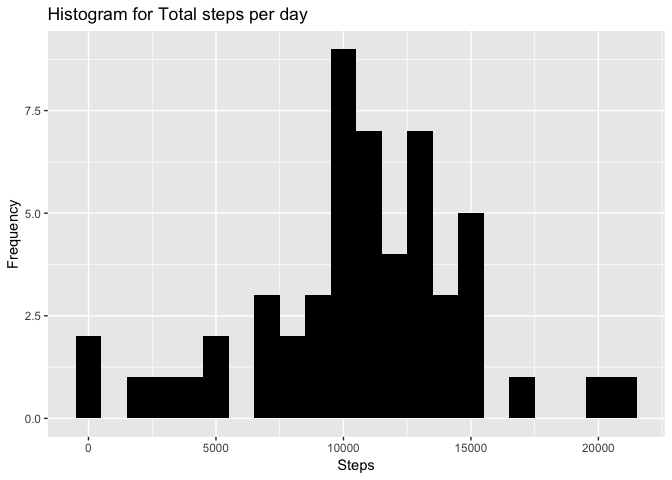
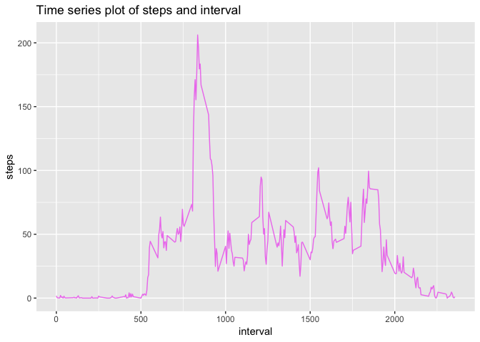
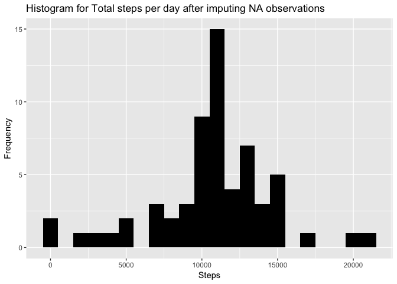
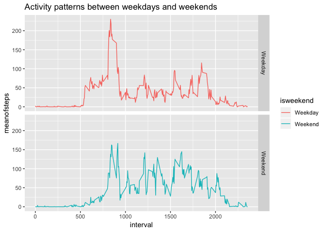

## Load necessary r packages and set working directory


```r
setwd("/Users/User1/Desktop/DataScience/Git/RepData_PeerAssessment1")
library(dplyr)
```

```
## 
## Attaching package: 'dplyr'
```

```
## The following objects are masked from 'package:stats':
## 
##     filter, lag
```

```
## The following objects are masked from 'package:base':
## 
##     intersect, setdiff, setequal, union
```

```r
library(ggplot2)
```

## Loading and preprocessing the data
	
	1. Load the data (i.e. `read.csv()`)
	
	Read activity csv data
	

```r
adata <- read.csv("activity.csv")
head(adata)
```

```
##   steps       date interval
## 1    NA 2012-10-01        0
## 2    NA 2012-10-01        5
## 3    NA 2012-10-01       10
## 4    NA 2012-10-01       15
## 5    NA 2012-10-01       20
## 6    NA 2012-10-01       25
```

```r
str(adata)
```

```
## 'data.frame':	17568 obs. of  3 variables:
##  $ steps   : int  NA NA NA NA NA NA NA NA NA NA ...
##  $ date    : Factor w/ 61 levels "2012-10-01","2012-10-02",..: 1 1 1 1 1 1 1 1 1 1 ...
##  $ interval: int  0 5 10 15 20 25 30 35 40 45 ...
```
	
	2. Process/transform the data (if necessary) into a format suitable for your analysis
	
	Convert date column values into date format and remove NA observations


```r
adata$date <- as.Date(as.character(adata$date))
adata2 <- adata[!is.na(adata$steps),]
str(adata2)
```

```
## 'data.frame':	15264 obs. of  3 variables:
##  $ steps   : int  0 0 0 0 0 0 0 0 0 0 ...
##  $ date    : Date, format: "2012-10-02" "2012-10-02" ...
##  $ interval: int  0 5 10 15 20 25 30 35 40 45 ...
```


## What is mean total number of steps taken per day?

1. Make a histogram of the total number of steps taken each day

Sum up steps per date


```r
stepsperday <- aggregate(adata2$steps,by=list(adata2$date),sum)
names(stepsperday)<-c("date","totalsteps")
head(stepsperday)
```

```
##         date totalsteps
## 1 2012-10-02        126
## 2 2012-10-03      11352
## 3 2012-10-04      12116
## 4 2012-10-05      13294
## 5 2012-10-06      15420
## 6 2012-10-07      11015
```

create histogram

```r
ggplot(stepsperday,aes(x=totalsteps))+geom_histogram(fill="black",binwidth=1000)+labs(title="Histogram for Total steps per day",x="Steps",y="Frequency")
```

<!-- -->

2. Calculate and report the **mean** and **median** total number of steps taken per day


```r
mean(stepsperday$totalsteps)
```

```
## [1] 10766.19
```

```r
median(stepsperday$totalsteps)
```

```
## [1] 10765
```

## What is the average daily activity pattern?

1. Make a time series plot (i.e. `type = "l"`) of the 5-minute interval (x-axis) and the average number of steps taken, averaged across all days (y-axis)

Calculate average(mean) of steps per 5-minute interval and create time series plot


```r
avgsteps <- aggregate(adata2$steps,by=list(adata2$interval),mean)
names(avgsteps)<-c("interval","stepsavg")
head(avgsteps)
```

```
##   interval  stepsavg
## 1        0 1.7169811
## 2        5 0.3396226
## 3       10 0.1320755
## 4       15 0.1509434
## 5       20 0.0754717
## 6       25 2.0943396
```

```r
ggplot(avgsteps,aes(x=interval,y=stepsavg))+geom_line(color="violet")+labs(title="Time series plot of steps and interval",x="interval",y="steps")
```

<!-- -->


2. Which 5-minute interval, on average across all the days in the dataset, contains the maximum number of steps?


```r
avgsteps[avgsteps$stepsavg==max(avgsteps$stepsavg),]
```

```
##     interval stepsavg
## 104      835 206.1698
```


## Imputing missing values

1. Calculate and report the total number of missing values in the dataset (i.e. the total number of rows with `NA`s)


```r
sum(is.na(adata))
```

```
## [1] 2304
```

2. Devise a strategy for filling in all of the missing values in the dataset. The strategy does not need to be sophisticated. For example, you could use the mean/median for that day, or the mean for that 5-minute interval, etc.

Replace steps NA values with mean value calculated per that interval


```r
meanvaluereplacefn <- function(x) replace(x, is.na(x), mean(x, na.rm=TRUE))
cleanadata <- adata %>% group_by(interval) %>% mutate(steps=meanvaluereplacefn(steps))
```

3. Create a new dataset that is equal to the original dataset but with the missing data filled in.

created cleaned up dataset by replacing NA values with mean values of tht group interval. see few rows from 
cleaned up data and confirm there are no NA observations anymore


```r
head(cleanadata)
```

```
## # A tibble: 6 x 3
## # Groups:   interval [6]
##    steps date       interval
##    <dbl> <date>        <int>
## 1 1.72   2012-10-01        0
## 2 0.340  2012-10-01        5
## 3 0.132  2012-10-01       10
## 4 0.151  2012-10-01       15
## 5 0.0755 2012-10-01       20
## 6 2.09   2012-10-01       25
```

```r
sum(is.na(cleanadata))
```

```
## [1] 0
```

4. Make a histogram of the total number of steps taken each day and Calculate and report the **mean** and **median** total number of steps taken per day. Do these values differ from the estimates from the first part of the assignment? What is the impact of imputing missing data on the estimates of the total daily number of steps?

create histogram with the cleaned up data of total number of steps taken each day


```r
stepsperday2 <- aggregate(cleanadata$steps,by=list(cleanadata$date),sum)
names(stepsperday2)<-c("date","totalsteps")
ggplot(stepsperday2,aes(x=totalsteps))+geom_histogram(fill="black",binwidth=1000)+labs(title="Histogram for Total steps per day after imputing NA observations",x="Steps",y="Frequency")
```

<!-- -->

calculate new mean and median for cleaned up data


```r
mean(stepsperday2$totalsteps)
```

```
## [1] 10766.19
```

```r
median(stepsperday2$totalsteps)
```

```
## [1] 10766.19
```

old mean and median for filtered data (omitted NA observations)

```r
mean(stepsperday$totalsteps)
```

```
## [1] 10766.19
```

```r
median(stepsperday$totalsteps)
```

```
## [1] 10765
```

It seems after cleaning up data, median and mean are same


## Are there differences in activity patterns between weekdays and weekends?

For this part the `weekdays()` function may be of some help here. Use
the dataset with the filled-in missing values for this part.

1. Create a new factor variable in the dataset with two levels -- "weekday" and "weekend" indicating whether a given date is a weekday or weekend day.


```r
cleanadata$weekday <- weekdays(cleanadata$date)
head(cleanadata)
```

```
## # A tibble: 6 x 4
## # Groups:   interval [6]
##    steps date       interval weekday
##    <dbl> <date>        <int> <chr>  
## 1 1.72   2012-10-01        0 Monday 
## 2 0.340  2012-10-01        5 Monday 
## 3 0.132  2012-10-01       10 Monday 
## 4 0.151  2012-10-01       15 Monday 
## 5 0.0755 2012-10-01       20 Monday 
## 6 2.09   2012-10-01       25 Monday
```

```r
cleanadata$isweekend <- ifelse(cleanadata$weekday=="Saturday" | cleanadata$weekday=="Sunday", "Weekend", "Weekday" )
head(cleanadata)
```

```
## # A tibble: 6 x 5
## # Groups:   interval [6]
##    steps date       interval weekday isweekend
##    <dbl> <date>        <int> <chr>   <chr>    
## 1 1.72   2012-10-01        0 Monday  Weekday  
## 2 0.340  2012-10-01        5 Monday  Weekday  
## 3 0.132  2012-10-01       10 Monday  Weekday  
## 4 0.151  2012-10-01       15 Monday  Weekday  
## 5 0.0755 2012-10-01       20 Monday  Weekday  
## 6 2.09   2012-10-01       25 Monday  Weekday
```

2. Make a panel plot containing a time series plot (i.e. `type = "l"`) of the 5-minute interval (x-axis) and the average number of steps taken, averaged across all weekday days or weekend days (y-axis). 

Calculate mean per weekend and interval

```r
meanweekenddata <- aggregate(cleanadata$steps , by= list(cleanadata$isweekend, cleanadata$interval), mean)
names(meanweekenddata)=c("isweekend","interval","meanofsteps")
str(meanweekenddata)
```

```
## 'data.frame':	576 obs. of  3 variables:
##  $ isweekend  : chr  "Weekday" "Weekend" "Weekday" "Weekend" ...
##  $ interval   : int  0 0 5 5 10 10 15 15 20 20 ...
##  $ meanofsteps: num  2.2512 0.2146 0.4453 0.0425 0.1732 ...
```

```r
head(meanweekenddata)
```

```
##   isweekend interval meanofsteps
## 1   Weekday        0  2.25115304
## 2   Weekend        0  0.21462264
## 3   Weekday        5  0.44528302
## 4   Weekend        5  0.04245283
## 5   Weekday       10  0.17316562
## 6   Weekend       10  0.01650943
```

Make grid plot as requested for activity patterns between weekdays and weekends


```r
ggplot(meanweekenddata, aes(x=interval, y=meanofsteps, color=isweekend)) + geom_line() + facet_grid(isweekend ~ .) + labs(title="Activity patterns between weekdays and weekends")
```

<!-- -->


